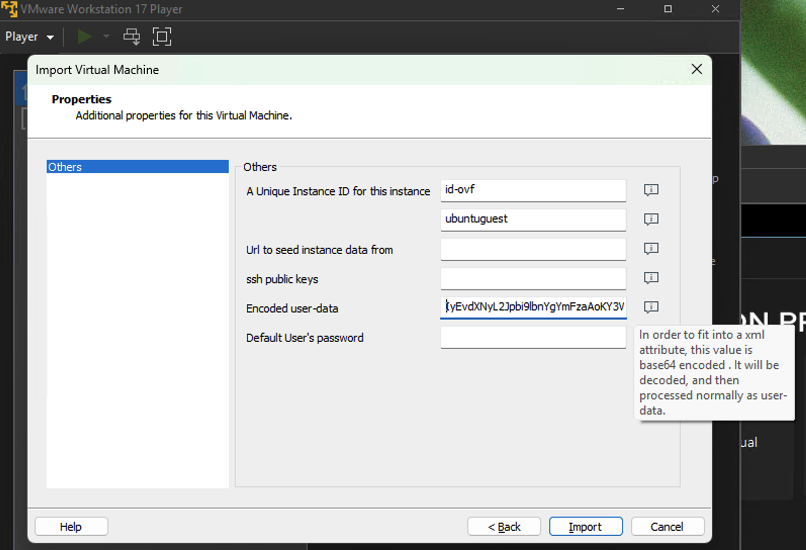

# Deploy SE on VMware by Creating a New Virtual Machine

This guide explains how to set up a new virtual machine (VM) dedicated to the Service Edge (SE) function within your VMware infrastructure.

## Deployment Steps

1. **Choose an Ubuntu LTS Image**  
   To create a new Linux VM, use an Ubuntu LTS image in OVA format for quick deployment. For example, visit the [`Ubuntu 24.04 LTS (Noble Numbat)`](https://cloud-images.ubuntu.com/noble/current/) page and note the URL of the [`OVA build`](https://cloud-images.ubuntu.com/noble/current/noble-server-cloudimg-amd64.ova). 

1. **(Optional) Download the OVA File**  
   Downloading the OVA file is optional, since some VMware products allow you to load the OVA directly using its URL.

1. **Create the Virtual Machine**  
   - Use the downloaded OVA file or the OVA URL to create the VM.  
   - During setup, provide the bootstrapping string (Base64 encoded) as the user data.  
     - Obtain the bootstrapping string from the **"Networking → Service Edges"** section of the Mammoth Cyber Management Portal.  
     - **Important:** Since the bootstrapping string contains unique identifiers, do not reuse it unless replacing an existing SE after stopping it. Treat the bootstrapping string as a sensitive credential - do not store it in shared locations or check it into source control.  

   

1. **Verify SE Connection Status**  
   The bootstrapping process may take a few minutes, depending on network connectivity. Once completed, the SE should appear as connected in the Mammoth Cyber Management Portal.

1. **(Optional) Adjust VM Settings**  
   - Check and adjust network settings, memory, CPU, and disk allocations for the new VM.  
   - Default configurations are sufficient for most cases, but monitor the VM's performance and adjust resources as needed to handle traffic load effectively.

---

By following these steps, you can successfully deploy an SE on VMware.