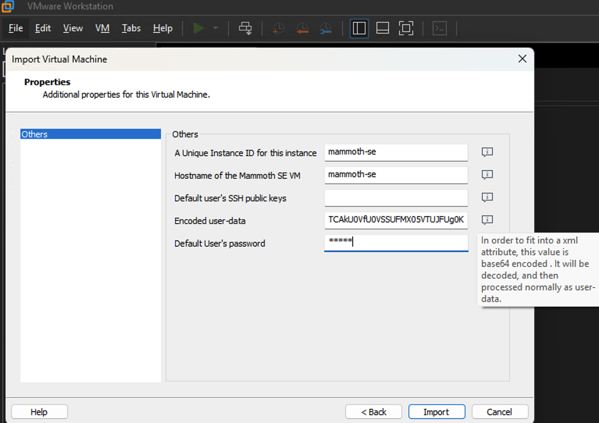

# Deploy the pre-built VM template on VMware

This guide explains how to use our pre-built template to set up a new virtual machine (VM) dedicated to the Service Edge (SE) function within your VMware infrastructure.

## Deployment Steps

1. **Locate pre-built VM template**  
   The latest VM template is located in [release section](https://github.com/appaegis/bootstrap/releases/latest).

   Our pre-built VM template is based on most recent Ubuntu LTS optimized for cloud. For example, the [`Ubuntu 24.04 LTS (Noble Numbat)`](https://cloud-images.ubuntu.com/noble/current/) page and note the URL of the [`OVA build`](https://cloud-images.ubuntu.com/noble/current/noble-server-cloudimg-amd64.ova).

   We also install the latest docker engine, docker-compose and our latest container image.

1. **(Optional) Download the OVA File**  
   Downloading the OVA file is optional, since some VMware products allow you to load the OVA directly using its URL.

1. **Create the Virtual Machine**  
   - Use the downloaded OVA file or the OVA URL to create the VM.  
   - During setup, provide the bootstrapping string (Base64 encoded) as the user data.  
     - Obtain the bootstrapping string from the **"Networking → Service Edges"** section of the Mammoth Cyber Management Portal.  
     - **Important:** Since the bootstrapping string contains unique identifiers, do not reuse it unless replacing an existing SE after stopping it. Treat the bootstrapping string as a sensitive credential - do not store it in shared locations or check it into source control.
     - Please remember to provide an initial password. Although the system will require a password change, it is still a "live" password and can be used to login to the default user "ubuntu".
     As a security measure, password based SSH login is disabled by default.
     
   

1. **Post-Install Settings**  
   Although Service Edge is expected to be up and running automatically, it might be necessary to perform a few post-install setting manually.
   - Reset default user's password. It is a good idea to validate that you can use the specified default password login and take the opportunity to reset that password.
   - Network settings. By default we assume that network setting is DHCP. If you use static IP configuration, you need to set it manually.
      - Add a config under `/etc/netplan`. You can use the template provided by us at `/etc/netplan/80-static-ip.yaml`
      - Make the change take effect by running `sudo netplan apply`
   - Allow SSH login through password. **Doing this may increase security risk, please consider alternatives.**
      - Find the file `/etc/ssh/sshd_config.d/60-cloudimg-settings.conf` and change the option `PasswordAuthentication` to `yes`.
      - Make the change take effect by running `sudo systemctl restart ssh`
   - (Optional) Check and apply OS hardening settings.
      - We preloaded ansible playbook from [ansible-lockdown](https://github.com/ansible-lockdown/UBUNTU24-CIS) to harden the Ubuntu VM according to [CIS benchmark](https://www.cisecurity.org/cis-benchmarks). You can run `ansible-playbook -v hardening-site.yml` under the `/root` directory to apply the OS hardening settings.

1. **Verify SE Connection Status**  
   The bootstrapping process may take a few minutes, depending on network connectivity. Once completed, the SE should appear as connected in the Mammoth Cyber Management Portal.

1. **(Optional) Adjust VM Settings**  
   - Check and adjust network settings, memory and CPU for the new VM.  
   - Default configurations are sufficient for most cases, but monitor the VM's performance and adjust resources as needed to handle traffic load effectively.

---

By following these steps, you can successfully deploy our pre-built SE on VMware.